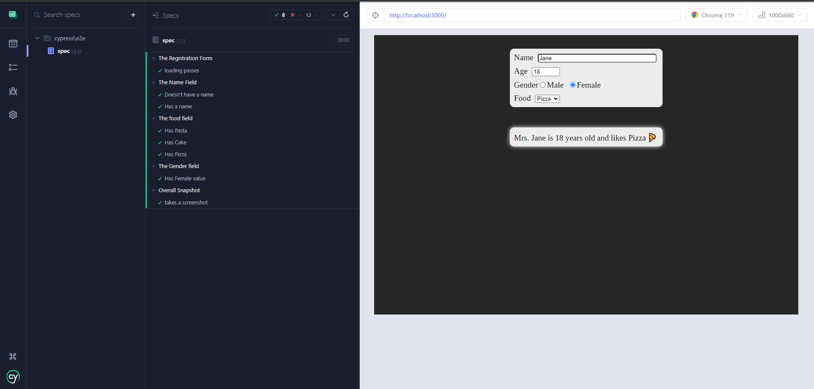

# MyFullStackExample
## How to perform an end-to-end test of a React app using Cypress 

### About
This is my project of building a ReactJS application and running tests using Cypress. I will be going over the steps to set up the application and accessing it with Cypress, then going over the tests.
In the testing section I will include the code snippets I input along with any edits I made. All the code can be accessed in the link provided.
https://bugfender.com/blog/how-to-perform-an-end-to-end-test-of-a-react-app-using-cypress/

### Intro 1. Building The ReactJS Application
First, I executed the command to create a basic ReactJS app ready to be initialized on a local host server. After prompting the user to input a name with necessary string edits, the next step involved replacing the code in the App.js file.

The ReactJS component designed featured four inputs: name, age, gender, and food. Each input was associated with an event handler, the handleChange method, to detect and modify the component’s state based on user interactions. This facilitated real-time updates to the displayed message as the component's state evolved.

To visually represent the architecture, consider the following bullet points:

* User Interaction: Inputs for name, age, gender, and food choices.
* Handling: Utilization of the handleChange method to modify the component’s state on user interaction.
* State-Driven Messaging: Dynamic messaging based on the component’s state changes.

Next, the contents of the App.css file were modified to handle the display information of the App.js data. This setup laid the foundation for the Cypress application to seamlessly automate the testing process, as detailed in the following steps.

### Intro 2. The End-to-End Test Using Cypress
In this section I setup the Cypress application and initialize a test run. 
First I launch the Cypress application and set up the specs along with creating the config files, and creating the initial spec.cy.js file.

This creates file from which all the following tests will be run from, but for now I just run the test spec to confirm the file can be found and run as normal.


Launching the Cypress application


Running the test case

### Intro 3. Understanding Test Cases
In this section I change the way Cypress accesses the server to my local server.
I edit the spec file so that instead of connecting to example.cypress.io, it instead connects to my localhost server and runs an initial test.
Confirming the test and my local server is accessed successfully I move on to the official tests.


Test case of connecting to the local server
### Test 1: The Name Field
```
describe('The Name Field', () => {
  it("Doesn't have a name", () => {
    cy.get('input[name="name"]').clear();
    cy.get('.details > p').should('contain',"You need a name!!!");
  });

  it('Has a name', () => {
    cy.get('input[name="name"]')
    .clear().type('Jane');
    cy.get('.details').should('contain', 'Jane');
  });
});
```
This section first checks whether the expected message appears when the name field has no input, and the second confirms the name appears in the message when a name is imputed into the name field.
The edits I made to this code chunk is to first connect to the localhost server so it can run the tests at all. The second test also comes with the caveat that the tested name should match the input name, otherwise the test fails.:
```
describe('The Name Field', () => {
  it("Doesn't have a name", () => {
    cy.visit('http://localhost:3000');
    cy.get('input[name="name"]').clear();
    cy.get('.details > p').should('contain',"You need a name!!!");
  });

  it('Has a name', () => {
    cy.visit('http://localhost:3000');
    cy.get('input[name="name"]')
    .clear().type('Jane');
    cy.get('.details').should('contain', 'Jane');
  });
});
```

Test case of testing filled out namespace

### Test 2: The Food Field
The initial code is as follows:
```
describe('The food field', () => {
  it('Has Pasta', () => {
    cy.get('select').select("Pasta");
    cy.get('.details > p').should('contain',"🍝");
  });

  it('Has Cake', () => {
    cy.get('select').select("Cake");
    cy.get('.details > p').should('contain',"🎂");
  });

  it('Has Pizza', () => {
    cy.get('select').select("Pizza");
    cy.get('.details > p').should('not.contain',"🎂");
  });
});
```
This code tests whether the food choice has selected pasta, cake, or pizza from the select function. The code below shows my edits to input the name field along with any previous edits to make the test work:
```
describe('The food field', () => {
  it('Has Pasta', () => {
    cy.visit('http://localhost:3000');
    cy.get('input[name="name"]')
    .clear().type('Jane');
    cy.get('select').select("Pasta");
    cy.get('.details > p').should('contain',"🍝");
  });

  it('Has Cake', () => {
    cy.visit('http://localhost:3000');
    cy.get('input[name="name"]')
    .clear().type('Jane');
    cy.get('select').select("Cake");
    cy.get('.details > p').should('contain',"🎂");
  });

  it('Has Pizza', () => {
    cy.visit('http://localhost:3000');
    cy.get('input[name="name"]')
    .clear().type('Jane');
    cy.get('select').select("Pizza");
    cy.get('.details > p').should('not.contain',"🎂");
  });
});
```

confirmation of test cases for all food items

### Test 3: The Gender Field
Now, we check the radio button value and then validate the expectations using the check API.
The following checks whether the value 'F' has been selected:
```
describe('The Gender field', () => {
  it('Has Female value', () => {
    cy.get('[type="radio"]').check('F');
  });
});
```
Below are my edits to the code to fill out the rest of the fields:
```
describe('The Gender field', () => {
  it('Has Female value', () => {
    cy.visit('http://localhost:3000');
    cy.get('input[name="name"]')
    .clear().type('Jane');
    cy.get('select').select("Pizza");
    cy.get('[type="radio"]').check('F');
  });
});
```

Test case of selecting correct gender button

### Test 4: Take a Screenshot
The final step is to take a screenshot using all the steps from above. The code provided to do so is as follows:
```
describe('Overall Snapshot', () => {
  it('takes a screenshot', () => {
    cy.screenshot()
  })
})
```
I input all the fields from above and then had the screenshot line at the bottom:
```
describe('Overall Snapshot', () => {
  it('takes a screenshot', () => {
    cy.visit('http://localhost:3000');
    cy.get('input[name="name"]')
    .clear().type('Jane');
    cy.get('select').select("Pizza");
    cy.get('[type="radio"]').check('F');
    cy.screenshot()
  })
})
```

Final test case of taking a screenshot

### Conclusion

In conclusion, Cypress proved instrumental in automating the ReactJS application's testing process, offering an intuitive syntax and real-time interactive test runs for robust end-to-end testing. To further elevate the development workflow, integrating Continuous Integration (CI) and Continuous Deployment (CD) through tools like Jenkins or GitHub Actions ensures automatic builds, continuous validation, and streamlined deployments. Cypress seamlessly fits into this CI/CD pipeline, playing a pivotal role in maintaining efficiency and reliability throughout the software development lifecycle.